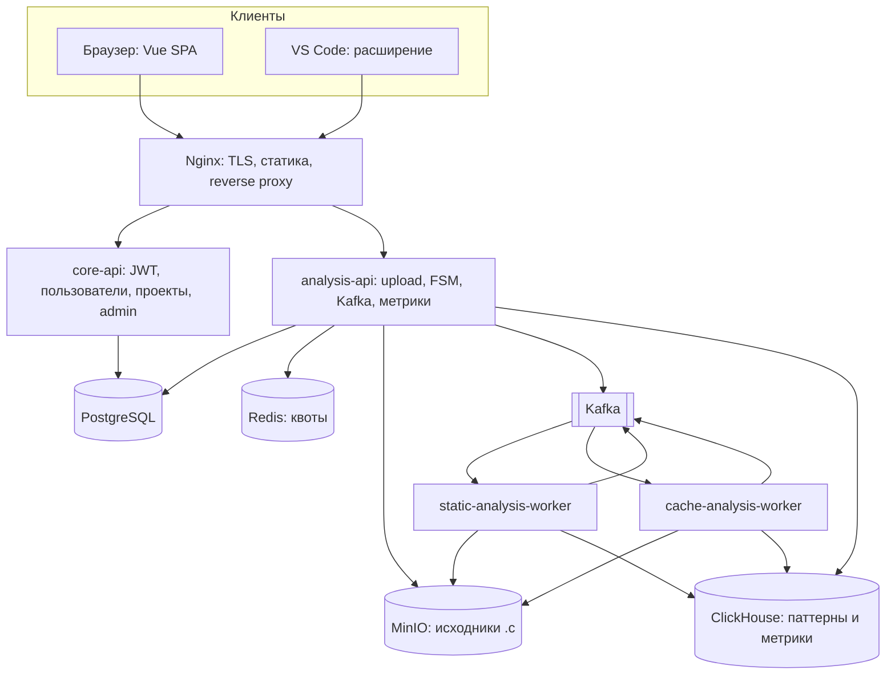
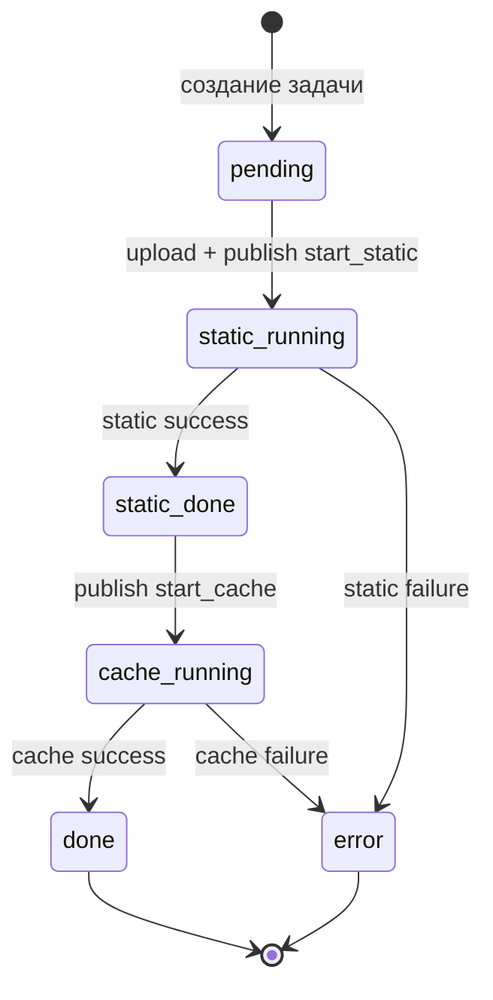
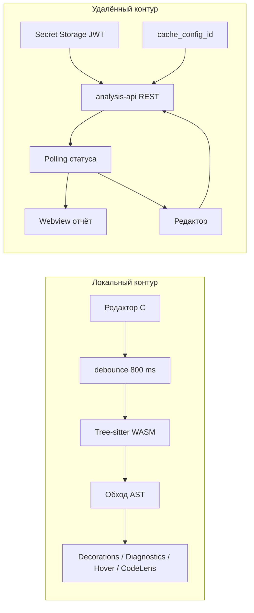
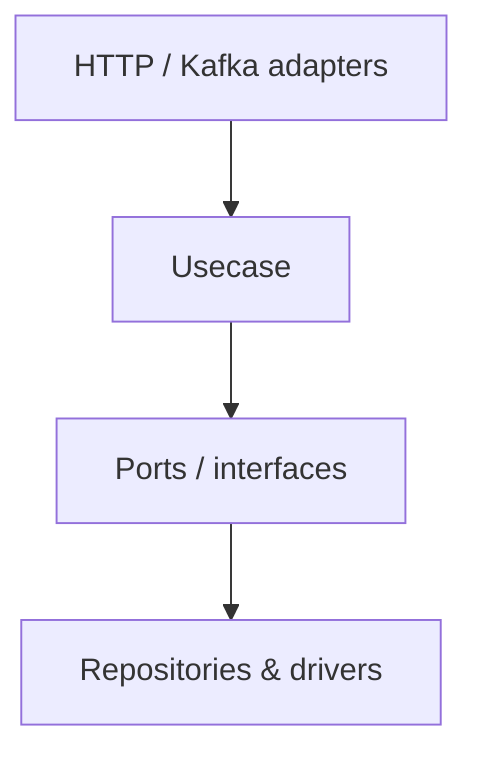

# Инфраструктура и клиентская часть платформы анализа кэш-поведения C-кода: архитектура и встраивание в IDE

**Аннотация.** В работе рассматривается программный комплекс для загрузки исходных текстов на языке C, асинхронной оркестрации конвейера анализа и представления результатов пользователю в веб-интерфейсе и в редакторе Visual Studio Code. Основной вклад относится к общей инфраструктуре (шлюз, брокер сообщений, хранилища, микросервисы API), к веб-клиенту на Vue 3 и к расширению редактора с локальным AST-анализом на базе Tree-sitter (web-tree-sitter, WASM). Детали реализации специализированных воркеров статического и динамического (кэш-симуляционного) анализа в объём настоящей статьи намеренно не выносятся и трактуются как внешние исполняемые компоненты конвейера.

**Ключевые слова:** микросервисы, event-driven архитектура, расширения IDE, Tree-sitter, Clean Architecture, веб-приложение, оркестрация задач, статический анализ.

---

## Содержание

1. [Введение](#введение)
2. [Обзор существующих решений и технологий](#1-обзор-существующих-решений-и-технологий)
   - 1.1. [Интеграция аналитических инструментов в IDE](#11-интеграция-аналитических-инструментов-в-ide)
   - 1.2. [Технологии парсинга](#12-технологии-парсинга-от-тяжёлых-компиляторов-к-инкрементальным-деревьям)
   - 1.3. [Технологии серверной инфраструктуры](#13-технологии-серверной-инфраструктуры-конвейерного-анализа)
3. [Предлагаемые решения](#2-предлагаемые-решения-встраивание-в-ide-и-алгоритмы)
   - 2.1. [Гибридное встраивание в Visual Studio Code](#21-гибридное-встраивание-в-visual-studio-code)
   - 2.2. [Алгоритм локального уровня](#22-алгоритм-извлечения-и-преобразования-структуры-кода-локальный-уровень)
   - 2.3. [Унификация клиентского опыта: веб-приложение](#23-унификация-клиентского-опыта-веб-приложение)
4. [Архитектура системы](#3-архитектура-предлагаемой-системы)
   - 3.1. [Логическая схема компонентов](#31-логическая-схема-компонентов)
   - 3.2. [Конечный автомат задачи анализа](#32-конечный-автомат-задачи-анализа)
   - 3.3. [Взаимодействие расширения VS Code](#33-взаимодействие-расширения-vs-code-локальный-и-удалённый-сценарии)
   - 3.4. [Слои серверного приложения](#34-слои-серверного-приложения-clean-architecture)
   - 3.5. [Пример: локальный анализ в IDE](#35-пример-работы-фрагмент-исходного-кода-и-ожидаемый-вывод-локального-анализа)
   - 3.6. [Пример: веб-клиент](#36-пример-работы-веб-клиент)
5. [Заключение](#заключение)

---

## Введение

Современная высокопроизводительная разработка на языках C и C++ неразрывно связана с оптимизацией работы с памятью. Из-за растущего разрыва между скоростью вычислений процессора и пропускной способностью оперативной памяти (проблема «стены памяти») производительность программ всё чаще упирается в эффективность использования кэш-иерархии. При этом профилирование кэш-промахов традиционно выполняется на поздних этапах с помощью тяжёлых утилит, что растягивает цикл обратной связи.

В индустрии закрепилась парадигма Shift-Left: проверки качества переносятся на ранние этапы — непосредственно в момент написания кода. Чтобы инструмент оценки кэш-дружелюбности был практически полезен, он должен быть доступен в привычной среде (IDE или браузер) и при необходимости опираться на серверные вычисления для ресурсоёмкой симуляции. Естественный способ доставки такого функционала — расширения для интегрированных сред разработки и единый HTTP API для веб-клиента.

Цель настоящей статьи — описать архитектуру платформы, реализующей **гибридный подход**: в Visual Studio Code выполняется быстрый локальный анализ на основе синтаксического дерева (Tree-sitter); при необходимости глубокого прогона файл уходит в масштабируемую серверную очередь, где конвейер статического анализа и кэш-симуляции формирует метрики и агрегаты; результаты возвращаются в редактор (Webview, декорации, диагностики) и отображаются во фронтенде теми же контрактами API.

---

## 1. Обзор существующих решений и технологий

### 1.1. Интеграция аналитических инструментов в IDE

Условно выделяются следующие классы решений:

1. **Плагины статического анализа общего назначения** (SonarLint, PVS-Studio и др.). Встраиваются в VS Code, Visual Studio, IDE JetBrains, реагируют на сохранение или фоновые проверки. Фокус на дефектах и правилах качества, а не на модели кэш-поведения в численном виде.

2. **Встроенные инструменты IDE** (например, экосистема JetBrains). Глубокий разбор через собственные PSI-подобные слои и CFG; сильная привязка к конкретной платформе.

3. **Интеграции профилировщиков** (Intel VTune и аналоги). Дают высокую точность на реальном железе или детальных моделях, но обычно требуют сборки, запуска и не ориентированы на мгновенную подсказку «на каждую правку строки».

Гибридная платформа дополняет этот спектр за счёт **лёгкого локального слоя** (эвристики по AST) и **согласованного серверного пайплайна** с явной моделью задачи и метриками.

### 1.2. Технологии парсинга: от тяжёлых компиляторов к инкрементальным деревьям

Традиционный путь — Language Server Protocol с бэкендом вроде clangd: высокая семантическая точность при наличии `compile_commands.json` и настроенной сборки.

Для интерактивного расширения, которому нужна устойчивость к неполному коду и низкая задержка, уместен **инкрементальный парсинг**. Библиотека Tree-sitter с генерацией парсеров и поставкой в виде WebAssembly позволяет в процессе расширения VS Code (Node.js Extension Host) быстро строить AST и обходить узлы без поднятия полного компилятора. В реализованном клиенте используется связка **web-tree-sitter** и WASM-модуля для языка C.

### 1.3. Технологии серверной инфраструктуры конвейерного анализа

Типичные элементы таких систем:

- **Асинхронные очереди** (Apache Kafka, RabbitMQ) — разделение приёма запросов и тяжёлых воркеров, сглаживание пиков.
- **Специализированные хранилища**: реляционная СУБД для пользователей и статусов задач, Redis для квот и ограничений, объектное хранилище (MinIO/S3) для исходников, колоночная СУБД (ClickHouse) для больших объёмов телеметрии и агрегатов симуляции.
- **Слоистая серверная архитектура** (Clean Architecture на Go): обработчики HTTP и потребители Kafka не смешиваются с бизнес-правилами переходов состояния задачи и работой с абстракциями репозиториев.

Ниже эти элементы привязаны к конкретной реализации репозитория платформы.

---

## 2. Предлагаемые решения (встраивание в IDE и алгоритмы)

### 2.1. Гибридное встраивание в Visual Studio Code

Расширение реализует два канала:

1. **Локальный анализ.** При редактировании файлов C (при включённой настройке `analyzer.autoLocalAnalysis`) срабатывает **debounce 800 ms** на событие изменения документа. Текст парсится Tree-sitter’ом; обход AST формирует список записей о паттернах доступа. Результат отображается через API расширения: подсветка строк (**decorations**), **Diagnostics** (панель Problems), **Hover**, **CodeLens**. Работа выполняется в памяти процесса расширения, без сети.

2. **Удалённый анализ.** По команде из палитры или статус-бара пользователь после аутентификации отправляет текущий файл на `analysis-api` (**multipart**: проект, идентификатор JSON-конфига симулятора кэша, файл). Сервер возвращает задачу; клиент **поллит** статус до терминального состояния, затем собирает связку метрик, агрегированных паттернов и при необходимости дополнительных данных. Отчёт открывается в **Webview** (`ReportPanel`); при наличии координат паттернов те же результаты могут быть наложены на редактор (в т.ч. в случае ошибки cache-стадии при сохранившихся статических данных).

**Аутентификация.** Поддерживаются: сквозной вход через аккаунт VS Code (OAuth GitHub с получением email и обмен на JWT платформы через `core-api`) и ручной вход email/паролем. Токен хранится в **Secret Storage**. Для серверного запуска обязателен выбор **JSON-конфига симулятора кэша** (`cache_config_id`): его можно загрузить с диска, выбрать из списка сохранённых на сервере или создать из встроенного образца. Активный конфиг отображается отдельным элементом статус-бара (первые 8 символов UUID).

### 2.2. Алгоритм извлечения и преобразования структуры кода (локальный уровень)

Локальный анализ не симулирует выполнение программы на процессоре; он классифицирует обращения к памяти в телах циклов по AST.

Общая идея шагов:

1. **Обход функций и циклов.** Узлы `for_statement`, `while_statement`, `do_statement`; для `for` извлекается индукционная переменная (инициализатор объявления или присваивание).

2. **Поиск `subscript_expression`.** В теле цикла находятся индексные обращения к массивам; фиксируются база (`argument`), выражение индекса (`index`), позиция в файле.

3. **Классификация индекса** (упрощённо):
   - **`unit_stride`** — идентификатор совпадает с переменной цикла; линейные комбинации с константным смещением (`i + k`); унарный минус по итератору; умножение итератора на 1.
   - **`non_unit_stride`** — умножение итератора на константу \(> 1\); битовые сдвиги с эквивалентным шагом.
   - **`gather_scatter`** — вложенное индексирование (косвенный доступ через другой массив).
   - **`constant`** — литерал или индекс, не использующий переменные текущих циклов при их наличии.
   - **`random`** — сложные или неоднозначные выражения (две переменные цикла в индексе, деление/остаток и т.д.).

4. **Эвристики «качества» строки.** По типу паттерна задаётся оценка заполнения кэш-линии и производная оценка промахов; от этого выводится **severity** для диагностики (`info` / `warning` / `error`). Записи с одинаковым ключом (строка, база, текст индекса) дедуплицируются с приоритетом большей «тяжести».

5. **Отображение.** Результаты унифицированы с серверной моделью записей анализа (`AnalysisEntry`), чтобы один и тот же код мог рисовать и локальные, и серверные подсказки.

### 2.3. Унификация клиентского опыта: веб-приложение

Веб-клиент (**Vue 3, Vite, Pinia, Tailwind CSS v4**) реализует те же сценарии удалённого пайплайна, что и расширение: регистрация и вход, проекты, загрузка `.c`, выбор JSON-конфига симулятора, опрос статуса задачи, панели метрик и паттернов. Для редактирования и просмотра C-кода встроен **Monaco Editor** (`@guolao/vue-monaco-editor`). Страница **«Песочница»** (`/sandbox`) повторяет по смыслу сценарий расширения: привязка к проекту, список файлов, обязательный конфиг перед запуском.

Структура каталогов **`src/`** следует идеям **Feature-Sliced Design**: слои `app`, `pages`, `widgets`, `features`, `entities`, `shared` с правилом импортов «сверху вниз», что отделяет маршрутизацию и страницы от доменных store и HTTP-клиента.

В production-сборке фронтенд отдаётся через **Nginx** на одном origin с проксированием `/api/v1/...` на `core-api` и `analysis-api`, что избегает лишнего CORS для браузера.

---

## 3. Архитектура предлагаемой системы

### 3.1. Логическая схема компонентов

Платформа построена как **event-driven микросервисная** система: лёгкий край (шлюз и API) отделён от воркеров конвейера.



**Поток данных (кратко).** Запросы аутентификации и управления проектами обслуживает `core-api` и PostgreSQL. Загрузка файла анализа выполняется в `analysis-api`: проверка дневной квоты в Redis, сохранение объекта в MinIO, создание записей файла и задачи в PostgreSQL, перевод задачи в состояние запуска статики и публикация события в Kafka. Воркеры потребляют топики, читают артефакты из MinIO, пишут результаты в ClickHouse и публикуют события завершения стадии; `analysis-api` по Kafka обновляет статус задачи и отдаёт его клиентам через REST.

### 3.2. Конечный автомат задачи анализа

Переходы состояния централизованы в `analysis-api`: это снимает гонки при обновлении статуса несколькими участниками и задаёт однозначный жизненный цикл задачи.



Строковые статусы в API: `pending`, `static_running`, `static_done`, `cache_running`, `done`, `error`. При ошибке синтаксиса или симуляции задача переводится в `error` с сообщением для клиента; клиенты могут показывать частичные результаты (например, статические паттерны), если они есть в ответе.

Важный инвариант оркестрации при загрузке: сначала атомарная проверка квоты, затем MinIO, затем запись в Postgres, затем обновление статуса перед отправкой сообщения в Kafka — чтобы воркер не получил событие по задаче без сохранённого артефакта и записи в БД.

### 3.3. Взаимодействие расширения VS Code: локальный и удалённые сценарии



**Скриншот для вставки в публикацию.** Сделайте скрин VS Code: открыт `.c` файл, видны цветные подсветки строк, панель Problems с диагностиками расширения, при наведении на индекс — всплывающая подсказка, над функцией — CodeLens с числом паттернов (локальный режим после правки текста).

### 3.4. Слои серверного приложения (Clean Architecture)

Для `core-api` и `analysis-api` характерно разделение:

- **Транспорт** — HTTP-хендлеры Gin, потребители Kafka; валидация входа и маппинг DTO.
- **Use case** — правила: регистрация, выпуск JWT, создание проекта, загрузка файла, переходы FSM при событиях из очереди, сбор метрик для клиента.
- **Интерфейсы** — абстракции репозиториев и клиентов хранилищ.
- **Инфраструктура** — реализации PostgreSQL, MinIO, Redis, ClickHouse, Kafka.

Зависимости направлены внутрь: ядро не знает о конкретном фреймворке маршрутизации, что упрощает тестирование и замену адаптеров.



### 3.5. Пример работы: фрагмент исходного кода и ожидаемый вывод локального анализа

Учебный фрагмент:

```c
#define N 1024
double a[N];
double b[N];
double c[N];

int main() {
    for (int i = 0; i < N; i++) {
        a[i] = b[i] + c[i] * 2.0;
    }
    double sum = 0.0;
    for (int j = 0; j < N; j++) {
        sum = sum + a[j];
    }
    return (int)sum;
}
```

**Ожидаемое поведение локального режима.** Обращения `b[i]`, `c[i]`, `a[i]` во внешнем цикле по `i` и `a[j]` во втором цикле классифицируются как последовательный доступ относительно соответствующего индуктора (`unit_stride` или эквивалент с константным смещением для выражений вроде `i` в составе более простых форм). Серьёзность диагностик для «хороших» паттернов обычно низкая (информационная), так как оценочный miss-rate малог для unit stride. В редакторе отображаются подсветка, записи в Problems, hover и сводный CodeLens по функции `main`.

**Скриншот.** Зафиксируйте этот или аналогичный файл в VS Code с включённым расширением: видны подсветки строк с доступами и содержимое одной диагностики при открытии из Problems.

**Удалённый режим.** После команды запуска анализа с выбранным проектом и JSON-конфигом симулятора расширение показывает прогресс на русском языке в уведомлении VS Code, поллит статус до `done` или `error`, затем может показать итоговое сообщение с долей попаданий/промахов, оценкой оптимизации и числом паттернов; при дедупликации задач на сервере в ответе может присутствовать указание на `reused_from_task_id`.

**Скриншот.** Окно Webview «Отчёт» после успешного серверного анализа: таблица или список паттернов, блок метрик (hit rate, miss rate, score), при ошибке cache — видимый fallback на статические данные, если они есть.

### 3.6. Пример работы: веб-клиент

После входа пользователь создаёт проект на дашборде, на странице проекта или в песочнице загружает `.c`, выбирает конфиг симулятора и запускает анализ. Отображается виджет этапов пайплайна (**AnalysisPipelineStatus**); по завершении доступны графики и таблицы (**MetricsPanel**, агрегированные паттерны). Администратор видит отдельные страницы пользователей, проектов и статуса системы (health зависимостей, очередь Kafka как индикатор нагрузки).

**Скриншот 1.** Браузер: страница проекта или песочницы — зона загрузки файла, выпадающий список или блок выбора JSON-конфига симулятора, индикатор статуса задачи «в работе».

**Скриншот 2.** Та же сессия после `done`: панель метрик (графики hit/miss, score), таблица паттернов с типами и строками.

**Скриншот 3 (опционально).** Админ-страница системного статуса или топ паттернов.

---

## Заключение

Описана инфраструктурная и клиентская часть платформы для оценки кэш-дружелюбности C-кода. Ключевая идея — **гибрид**: мгновенная эвристическая обратная связь в VS Code на Tree-sitter и масштабируемый серверный конвейер с Kafka, MinIO, PostgreSQL, Redis и ClickHouse. Веб-приложение на Vue 3 и расширение IDE используют согласованные API и общую модель задачи анализа; для симуляции кэша везде требуется явный JSON-конфиг, что унифицирует воспроизводимость экспериментов.

Перспективы развития включают поддержку дополнительных редакторов через LSP или отдельные клиенты, расширение набора эвристик и паттернов локального анализа, углубление интеграции с CI/CD для регрессионной проверки метрик на merge-request’ах.

---

*Список литературы и ссылки на источники добавляются отдельно автором.*
